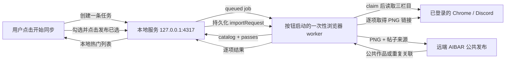

# 本地 Discord 手动公共发布编排服务

实现位于 [`../discord-import-service/`](../discord-import-service/)。

## 1. 目标与边界

本服务运行在 AIBAR 管理员自己的电脑上，把用户主动发起的一次 Discord 热门同步和公共发布变成可恢复、可审计的本地任务。它不是部署端容器，不是 Discord bot，也没有定时调度。本机只持有任务、热门榜、勾选请求和逐项结果；角色卡本体通过 `AIBAR_DISCORD_AIBAR_URL` 指定的正式 AIBAR 服务器解析并发布到公共社区，不进入本机 AIBAR 数据目录。

| 能力 | 本地服务 | 可见浏览器 worker | 部署端 AIBAR |
| --- | --- | --- | --- |
| 用户触发后创建任务 | 是 | 发起调用 | 否 |
| 记录标签与扫描覆盖 | 是 | 执行并上报 | 否 |
| 读取 Discord 页面 | 否 | 是 | 否 |
| 使用 Discord 登录态 | 否 | 使用现有 Chrome 会话 | 否 |
| 生成并展示热门清单 | 是 | 提交观察结果 | 否 |
| 保存勾选与逐项结果 | 是 | 执行并上报 | 否 |
| 下载角色卡 | 否 | 授权后获取短期 PNG 链接 | 通过手动入口解析 |
| 发布公共作品 | 否 | 提交来源并核验结果 | 服务器计算哈希、去重并发布 |

明确不做：

- 不自动创建每日任务，不做 T+1 或跨日回补。
- 不读取 Cookie、Discord token、Authorization header、localStorage 或浏览器密码。
- 不调用 Discord 私有 API，不使用 self-bot。
- 不保存 `/下载` 产生的短期附件 URL 或帖子密码。
- 不绕过 AIBAR 管理员会话、CSRF 和页面授权。

## 2. 完整交互



本地控制台创建任务后立即启动一条临时 `codex exec --ephemeral` 浏览器 worker；同步结束后进程退出，不等待也不轮询“发布已选”。用户点击“发布已选”时再启动第二条一次性 worker，只处理该次持久化请求并在完成或阻塞后退出。发布受阻或 worker 中途退出时，控制台会显示“继续发布”，点击后用同一份已持久化请求重启一条一次性发布 worker，剩余项（含 `failed` 重试）逐项处理；勾选内容不可更改。控制台状态通过 SSE 事件推送更新，没有定时任务或页面轮询；快照中的 `launcher` 字段反映一次性 worker 进程是否仍在运行，与 90 秒心跳窗口互补。

## 3. 手动快照语义

- 服务启动后不会自动生成 job。
- 每次点击控制台“开始同步”都会通过 `POST /api/v1/dashboard/trigger` 创建一个新的 `manual-*` job，不复用旧任务。
- 服务启动、SSE 连接、Worker heartbeat 和 worker CLI 都不能创建任务或启动 Worker。
- 默认周期是 `period: "today"`。
- 快照窗口固定为触发当日 `Asia/Shanghai 00:00` 到触发时刻。
- manifest 的 `syncedAt` 固定为触发时刻；即使扫描跨过午夜，`period: "today"` 仍对应原快照日期。
- 触发后新发布的帖子不进入本轮；用户再次同步会创建覆盖到新触发时刻的新任务。
- 候选发现使用 Discord“发帖日期”排序以完整覆盖时间窗，manifest 最终按回应数降序展示热门项。

可通过 `filters` 限制最终标签；不传时扫描全部标签并用无标签视图补漏。

## 4. 标签覆盖

worker 必须对三个固定栏目分别读取“查看所有标签”并上报非空标签目录。任一栏目实际出现空目录时应视为页面未加载完成或 Discord UI 异常，不能用空目录完成任务。

无最终标签限制时，完成条件是：

```text
coverage = every(source, unfiltered(source) + every(tagCatalog(source), tag => any:<tag>))
```

指定标签时，只要求与任务 `filters.tags` 和 `filters.tagMatch` 完全一致的 pass。多个视图中的帖子按 `threadId` 合并，回应数和回复数保留最大观察值。

## 5. 状态与批次

```mermaid
stateDiagram-v2
    [*] --> queued: 用户主动 trigger
    queued --> scanning: claim / catalog / pass
    scanning --> ready: 覆盖完整且有候选
    scanning --> empty: 覆盖完整且无候选
    ready --> delivered: 所有 manifest 批次已发布到本地榜单
    delivered --> waiting-selection: 清单已展示
    waiting-selection --> importing: 用户点击发布已选
    importing --> complete: 所有勾选项有终态结果
    waiting-selection --> blocked: 需要人工处理
    importing --> blocked: 需要人工处理
    blocked --> importing: 点击“继续发布”重启一次性 Worker
    queued --> failed: 明确失败
    scanning --> failed: 明确失败
    ready --> failed: 交接失败
```

单个 manifest 最多 200 项，单个任务最多 1000 项。`GET manifest` 返回：

```json
{
  "batchId": "64-character-sha256",
  "batchIndex": 0,
  "batchCount": 2,
  "manifest": {
    "version": 1,
    "period": "today",
    "cards": []
  }
}
```

worker 逐批读取 `manifest`，确认本地榜单已可展示后向 `delivered` 提交同一个 `batchId`，不再把 manifest 载入 AIBAR。确认是幂等的：响应丢失时重复提交不会多前进一批；提交未来批次或其他任务的 ID 会返回 409。最后一批确认后 `workflowStatus` 自动设为 `waiting-selection`。用户在本地控制台点击发布后生成持久化 `importRequest`；worker 通过 `workflow` 和 `import-item` 记录任务与每张卡的结果。内部状态名为兼容旧任务继续使用 `importing/imported`，其中 `imported` 只表示公共作品发布或重复关联成功。`complete` 要求所有请求项均为 `imported`、`failed` 或 `skipped`，并且不允许回退。

`empty` 不提供 manifest，避免空清单覆盖 AIBAR 当前批次。状态保存在 `discord-import-service/data/state.json`，使用原子替换写入。

## 6. 本地 HTTP API

服务只绑定 `127.0.0.1` 或 `::1`，校验 loopback Host，不返回 CORS header。控制台只公开任务摘要、手动建单和发布触发/继续；详细 job、扫描上报、manifest 与 worker heartbeat 仍要求本地 bearer token。所有 POST 必须是 `application/json`，请求体上限 2 MB。

| 方法 | 路径 | 用途 |
| --- | --- | --- |
| `GET` | `/health` | 存活检查 |
| `GET` | `/` | 本地控制台 |
| `GET` | `/api/v1/dashboard` | Worker 与最近任务摘要 |
| `GET` | `/api/v1/dashboard/events` | 以 SSE 推送 Worker 与任务状态，不轮询 |
| `POST` | `/api/v1/dashboard/trigger` | 创建手动任务并启动一次性同步 Worker |
| `POST` | `/api/v1/dashboard/jobs/:id/import-request` | 保存选择并启动一次性发布 Worker |
| `POST` | `/api/v1/dashboard/jobs/:id/import-resume` | 用已持久化的请求重启一次性发布 Worker（受阻或中断后） |
| `GET` | `/api/v1/config` | 固定来源、手动模式和 AIBAR 地址 |
| `GET` | `/api/v1/jobs` | 任务摘要列表 |
| `GET` | `/api/v1/jobs/latest` | 最新任务摘要 |
| `GET` | `/api/v1/jobs/:id` | 完整任务状态 |
| `POST` | `/api/v1/jobs/:id/claim` | 声明浏览器 worker |
| `POST` | `/api/v1/jobs/:id/catalog` | 按 `sourceChannelId` 上报某个 Discord 栏目的标签目录 |
| `POST` | `/api/v1/jobs/:id/passes` | 按 `sourceChannelId` 上报某个栏目筛选视图的结果 |
| `POST` | `/api/v1/jobs/:id/complete` | 检查覆盖并生成 manifest |
| `GET` | `/api/v1/jobs/:id/manifest` | 读取下一个批次信封 |
| `POST` | `/api/v1/jobs/:id/delivered` | 使用 `batchId` 幂等确认当前批次 |
| `POST` | `/api/v1/jobs/:id/workflow` | 更新等待勾选、发布中、完成或阻塞状态 |
| `POST` | `/api/v1/jobs/:id/import-item` | 更新单张卡的发布中、成功、失败或跳过状态 |
| `POST` | `/api/v1/jobs/:id/fail` | 记录明确失败原因 |
| `POST` | `/api/v1/worker/heartbeat` | 上报 Worker 在线状态与当前阶段 |

控制台触发请求：

```json
{
  "filters": {
    "tags": [],
    "tagMatch": "any"
  }
}
```

`filters` 可省略。`sourceDate`、调度时间和历史回填参数均不再接受。

## 7. 浏览器 worker 流程

1. 用户点击“开始同步”后，本地服务为新建 job 启动一次性 worker；worker 只读取该 job ID 的 `queued/scanning` 状态，绝不调用 `trigger`，也不查找或等待其他任务。
2. `claim` 后依次打开“纯文字”“轻前端·美化”“重前端·独立前端”三个固定 Discord forum，确认登录和成人内容状态正常。
3. 每个栏目都选择“发帖日期”，读取完整标签目录，并用该栏目的 `sourceChannelId` 上报 `catalog`。
4. 在每个栏目遍历其所有标签视图，再扫描无标签视图；pass 必须携带同一 `sourceChannelId`，只收集 job 快照窗口内的帖子。
5. 调用 `complete`，缺少覆盖时只补扫明确列出的视图。
6. 服务按真实来源栏目分别生成 manifest v1 批次；逐批读取信封并用其中的 `batchId` 调用 `delivered`，使三个栏目的结果合并显示在本地热门榜。
7. 任务进入 `waiting-selection` 后立即结束同步 worker，不等待、不轮询发布请求。
8. 用户勾选并点击“发布已选”后，本地服务启动新的单次 worker；它用 `get <jobId>` 读取已持久化请求，把 workflow 更新为 `importing`，按 [`discord-hot-import-runbook.md`](./discord-hot-import-runbook.md) 完成 `/下载`，只选择 PNG 卡体，并把卡片的栏目、线程、帖子、标题、作者和标签作为 URL 查询参数带到远端 AIBAR 手动入口。
9. 远端 AIBAR 解析卡体后调用管理员专用的 `/api/aibar/works/publish-discord`，由服务器计算 PNG SHA-256、复用同线程作品版本并去重。只有页面返回 `published` 或 `duplicate` 且给出公共作品入口时，worker 才用 `import-item` 记录成功；所有勾选项均有终态结果后把 workflow 更新为 `complete`。

## 8. 启动与验证

```bash
cd discord-import-service
npm start
```

服务可用 LaunchAgent 常驻，但 LaunchAgent 只保持 loopback API 运行；只有“开始同步”“发布已选”“继续发布”三个控制台按钮会启动临时 Codex Worker。模板位于 [`../discord-import-service/deploy/com.aibar.discord-import-service.plist.example`](../discord-import-service/deploy/com.aibar.discord-import-service.plist.example)。

验证：

```bash
npm run check
```
