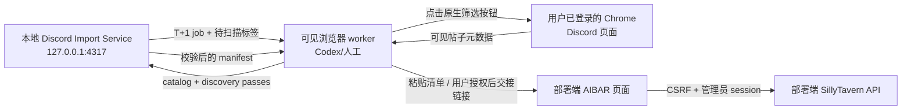
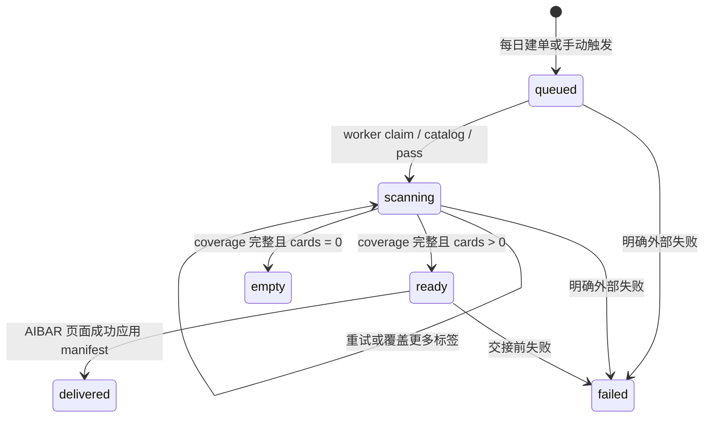

# 本地 Discord 导入子服务设计（Review Draft）

状态：待 review。实现位于 [`../discord-import-service/`](../discord-import-service/)。

## 1. 目标与边界

本服务运行在 AIBAR 管理员自己的电脑上，负责把每日 Discord T+1 采集变成可恢复、可审计的本地任务。它不是 AIBAR 部署端的新容器，也不是 Discord bot。

| 能力 | 本地子服务 | 可见浏览器 worker | 部署端 AIBAR |
| --- | --- | --- | --- |
| T+1 定时建单 | 是 | 否 | 否 |
| 记录标签按钮与扫描覆盖 | 是 | 执行并上报 | 否 |
| 读取 Discord 可见页面 | 否 | 是 | 否 |
| Discord 登录态 | 不接触 | 使用现有 Chrome 会话 | 不接触 |
| manifest 校验与生成 | 是 | 提交观察结果 | 再次校验并登记 |
| 下载短期 CDN 卡体 | 否 | 授权后获取链接 | 服务端代理下载 |
| 角色解析与社区发布 | 否 | 触发页面流程 | 是 |

明确不做：

- 不读取 Cookie、Discord token、Authorization header、localStorage 或浏览器密码。
- 不调用 Discord 私有 API，不使用 self-bot。
- 不在本地服务保存 `/下载` 产生的短期附件 URL 或帖子密码。
- 不用后台 HTTP 请求绕过 AIBAR 的管理员会话和 CSRF。
- 不在空扫描结果时覆盖 AIBAR 当前批次。

## 2. 组件关系



本地服务和部署端之间没有直连。manifest 必须经过 AIBAR 可见页面载入，这保留了账号、CSRF、用户授权和现有批次恢复语义。

## 3. T+1 语义

- 调度时区固定为 `Asia/Shanghai`。
- 默认每天 09:00 建立一个 `t1-YYYY-MM-DD` 任务。
- 任务窗口是前一自然日 `[00:00, 24:00)`，内部保存为 UTC ISO 时间。
- 服务在 09:00 后首次启动时会补建当天应有的任务；已经运行过的实例在休眠/停机跨天后唤醒时，会从最近一个默认任务的次日自动回补到昨天，最多回补 7 天。首次运行（无任何默认任务）仍只建昨天。
- 历史回填通过 `POST /api/v1/jobs/trigger` 显式指定 `sourceDate`；`sourceDate` 必须是已经结束的上海自然日，今天或未来日期会被 422 拒绝（窗口尚未闭合，所有帖子都会落在窗口外）。

调度只创建 `queued` job，不会自行启动或控制 Chrome。浏览器 worker 由 Codex heartbeat、人工命令或未来的本地扩展唤醒。

## 4. 标签覆盖模型

Discord 标签列表是频道动态配置，不能硬编码。worker 首先上报当日页面“查看所有标签”中实际可见的标签目录，然后逐项上报扫描 pass。**目录是覆盖检查的基准：未上报 catalog 前，`passes` 与 `complete` 都会返回 409**——否则一个 `unfiltered` pass 就能让空目录的覆盖检查通过，静默漏扫全部标签视图。

无最终标签限制时，完成条件为：

```text
coverage = unfiltered + every(tagCatalog, tag => any:<tag>)
```

也就是每个标签按钮各扫描一次，并清除标签做一次无标签补漏。多个视图里的帖子按 `threadId` 合并，回应数和回复数取已观察到的最大值。

指定标签时，只要求一个与 job 完全一致的 pass：

- `filters.tags = ["原创", "多路线"]`
- `filters.tagMatch = "any"` 对应 Discord“匹配部分”。
- `filters.tagMatch = "all"` 对应 Discord“全部匹配”。

服务会验证每张卡确实满足 job 筛选条件。缺任一 pass 时，`complete` 返回冲突错误，不生成 manifest。

## 5. 状态机



`empty` 不提供 manifest 下载接口，避免空清单覆盖线上批次。`delivered` 与 `failed` 是终态；同一来源日的默认 job 采用稳定 ID，重复触发不会重复建单。重复 `claim` 只在 `queued` 时把状态推进到 `scanning`：对 `ready` job 重新 claim 不会降级状态，manifest 保持可交接；需要补扫时由新的 pass 自然把状态拉回 `scanning`。

超过 200 张卡时，`complete` 会按回应热度把卡拆成多个 ≤ 200 的 manifest 批次（总量上限 1000，超过则显式失败）。`GET manifest` 始终返回下一个未交接批次，每次 `delivered` 前进一批；所有批次交接完成后 job 才进入 `delivered` 终态。AIBAR 页面对逐批「应用清单」是安全的：`mergeDiscordImportQueue` 按卡片 ID 保留已导入/失败状态与 `importedHashes`，前一批已导入的卡不会因换批而重复导入。

状态保存在 `discord-import-service/data/state.json`，原子替换写入，文件权限为 `0600`。该目录已 gitignore。

## 6. 本地 HTTP API

服务只允许绑定 `127.0.0.1` 或 `::1`，不返回 CORS header，所有 POST 必须使用 `application/json`（严格匹配媒体类型），请求体上限 2 MB。同时校验请求的 `Host` 头必须是 `127.0.0.1`、`localhost` 或 `[::1]`，否则返回 403——防御 DNS rebinding（远端页面把自有域名解析到 127.0.0.1 后读取任务数据或向 pass 投毒 manifest）。

除 `/health` 外的所有接口都要求 `Authorization: Bearer <token>`。token 在首次启动时生成到 `data/service-token`（0600），也可用 `AIBAR_DISCORD_SERVICE_TOKEN` 覆盖；`npm run client` 自动读取。这是 loopback 绑定和 Host 校验之外的第三层边界，防御本机其他非特权进程访问任务数据。

| 方法 | 路径 | 用途 |
| --- | --- | --- |
| `GET` | `/health` | 存活检查 |
| `GET` | `/api/v1/config` | 固定来源、调度时间和 AIBAR 目标页 |
| `GET` | `/api/v1/jobs` | 任务摘要列表 |
| `GET` | `/api/v1/jobs/latest` | 最新任务摘要 |
| `GET` | `/api/v1/jobs/:id` | 完整本地任务，供 review/恢复 |
| `POST` | `/api/v1/jobs/trigger` | 手动建单或历史回填 |
| `POST` | `/api/v1/jobs/:id/claim` | 声明当前浏览器 worker |
| `POST` | `/api/v1/jobs/:id/catalog` | 上报 Discord 当前标签目录 |
| `POST` | `/api/v1/jobs/:id/passes` | 上报一次筛选视图结果 |
| `POST` | `/api/v1/jobs/:id/complete` | 检查 coverage 并生成 manifest |
| `GET` | `/api/v1/jobs/:id/manifest` | 读取下一个未交接的 manifest 批次 |
| `POST` | `/api/v1/jobs/:id/delivered` | 确认当前批次已应用；还有剩余批次时 job 保持 `ready` |
| `POST` | `/api/v1/jobs/:id/fail` | 记录明确失败原因 |

### 标签目录

```json
{
  "observedAt": "2026-08-06T01:02:00.000Z",
  "tags": ["男性向", "女性向", "一般向", "原创", "多路线"]
}
```

### 扫描 pass

```json
{
  "observedAt": "2026-08-06T01:05:00.000Z",
  "view": {
    "tags": ["原创"],
    "tagMatch": "any",
    "sort": "created-at"
  },
  "posts": [
    {
      "id": "1479000000000000001",
      "threadId": "1479000000000000001",
      "title": "示例角色卡",
      "authorName": "ExampleAuthor",
      "sourceUrl": "https://discord.com/channels/1380075940285124724/1479000000000000001",
      "tags": ["原创", "多路线"],
      "publishedAt": "2026-08-05T03:20:00Z",
      "lastActiveAt": "2026-08-05T12:45:00Z",
      "reactionCount": 42,
      "replyCount": 8,
      "resource": {
        "availability": "browser",
        "kind": "character-card",
        "note": "授权后从帖子执行 /下载"
      }
    }
  ]
}
```

Pass 只允许 manifest 字段，不接受 `downloadUrl`、密码或任意额外字段。T+1 pass 必须使用 Discord“发帖日期”排序，帖子发布时间必须落在 job 窗口内。`resource.note` 上限 500 字符，与 AIBAR 前端 manifest 校验保持一致。

## 7. 浏览器 worker 流程

1. 读取 `latest`，对 `queued/scanning` job 执行 `claim`。
2. 打开固定 Discord forum；登录或成人内容确认未完成时调用 `fail`，不得生成空 pass 冒充成功。
3. 选择“发帖日期”，打开“查看所有标签”，上报 `catalog`。
4. 对每个标签按钮：清除旧选择、选择当前标签、保持“匹配部分”、等待网格稳定、采集 T 日帖子，上报 pass。
5. 清除全部标签，扫描无标签视图并上报 `unfiltered` pass。
6. 调用 `complete`；若返回 coverage 缺失，补扫明确列出的视图。
7. 获取 manifest，在 AIBAR 页面使用“粘贴清单”并点击“应用清单”。确认页面展示 `前一自然日（T+1）` 与正确筛选条件。
8. 应用成功后调用 `delivered`。若 job 摘要显示 `deliveredBatches < batchCount`，重新 `GET manifest` 拿下一批并重复第 7 步，直到 job 进入 `delivered`。服务到此结束；后续角色卡下载仍等待用户点击“导入已选”。

浏览器 worker 的完整 Discord `/下载` 与失败重试仍遵循 [`discord-hot-import-runbook.md`](./discord-hot-import-runbook.md)。

## 8. 本地运行与 launchd

开发运行：

```bash
cd discord-import-service
npm start
```

macOS 常驻可从 [`../discord-import-service/deploy/com.aibar.discord-import-service.plist.example`](../discord-import-service/deploy/com.aibar.discord-import-service.plist.example) 复制个人 LaunchAgent，替换其中绝对路径后加载。模板不直接安装，review 阶段不会修改用户的 `~/Library/LaunchAgents`。

日志和状态都应指向 `discord-import-service/data/`，不得提交到仓库。

## 9. 故障与恢复

| 故障 | 行为 |
| --- | --- |
| 本地服务重启 | 从 `state.json` 恢复 job、coverage 和已合并帖子 |
| 同一 pass 重试 | 覆盖对应 coverage 记录，帖子继续按 thread 合并 |
| 标签在扫描中变更 | 重新上报 catalog；`complete` 按最新目录检查覆盖 |
| Chrome/AIBAR 未登录 | job 标记 failed，保留线上旧批次 |
| 前一日无帖子 | job 进入 empty，不提供 manifest |
| 超过 200 项 | 按热度拆批逐批交接；超过 1000 项 complete 显式失败 |
| 机器休眠/停机跨天 | 唤醒后自动回补漏掉的日期（最多 7 天），更早日期手动 trigger |
| AIBAR 应用失败 | job 保持 ready，可重复读取同一批次 manifest |

## 10. Review 重点

1. 本地服务与可见浏览器 worker 的边界是否符合预期；当前实现刻意不内嵌 Chrome/CDP 控制。
2. 默认“遍历全部标签 + 无标签补漏”的成本是否可接受，还是只需要用户配置的标签集合。
3. ~~200 项上限是否需要设计多批次协议~~ 已实现：按热度拆批逐批交接，总量上限 1000。
4. 是否在 review 后把现有 Codex heartbeat 改到 09:05，消费 09:00 由本服务创建的 job。
5. ~~是否需要给 loopback API 增加本地 bearer token~~ 已实现：`data/service-token` bearer token + loopback 绑定 + Host 头校验 + 严格 JSON-only POST。

建议先以 observe-only 方式运行 2 到 3 天：完成 catalog/pass/manifest 生成，但不自动粘贴 AIBAR。确认覆盖计数和日期边界后，再让 heartbeat 执行页面交接。
