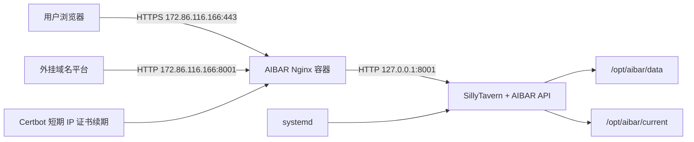
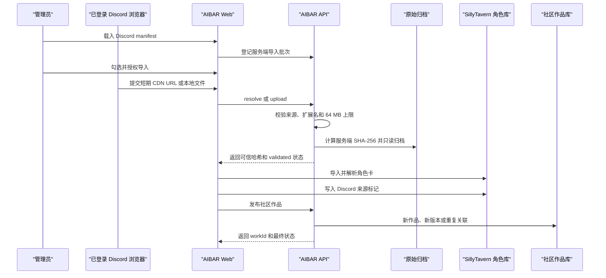

# AIBAR 服务器部署方案

> 状态：已于 2026-08-03 完成首次部署，并补充外挂域名源站入口。
>
> 目标服务器：`172.86.116.166`
>
> 直接入口：`https://172.86.116.166/aibar/`
>
> 外挂域名源站：`http://172.86.116.166:8001`

## 1. Review 决策

执行前需要确认以下决策：

1. 保留 `https://172.86.116.166/aibar/` 直接入口，同时由受限 Nginx 在 `172.86.116.166:8001` 提供 HTTP 源站，供外部域名平台反向代理。
2. 部署时生成独立的随机管理员密码，只在交付时展示一次，不复用 root 密码。
3. 本次只部署 AIBAR Web 和 SillyTavern 后端，不部署 `telegram-bot/`，也不改动服务器上现有的 Sub2API、AnyTLS、sing-box 和 OpenClaw 服务。

## 2. 范围

本方案覆盖：

- 固定并打包当前主仓库和 SillyTavern 子模块版本。
- 在服务器上安装生产依赖和 AIBAR 静态资源。
- 以独立低权限账号运行 SillyTavern。
- 使用 systemd 管理 Node 服务。
- 使用 Docker Nginx 和现有 IP 证书提供 HTTPS。
- 提供只转发 AIBAR 必要路径的公网 HTTP 源站端口，供外挂域名使用。
- 初始化并保护 `default-user` 管理员账号。
- 建立数据持久化、备份、验收和回滚流程。

本方案不覆盖：

- 域名购买和 DNS。
- Telegram companion。
- 外部 PostgreSQL、Redis 或 LiteLLM。
- 高可用、多机部署和对象存储。
- 对服务器现有应用进行迁移或端口调整。

## 3. 已确认的服务器现状

以下信息来自 2026-08-03 的只读勘察：

| 项目 | 现状 |
| --- | --- |
| 操作系统 | Ubuntu 24.04.3 LTS，x86_64 |
| Node.js | `v22.23.0` |
| npm | `10.9.8` |
| Docker | 已安装并运行 |
| AIBAR | 尚未部署 |
| 宿主机 Nginx/Caddy/PM2 | 未安装 |
| 主 IP `172.86.116.166:80` | 空闲 |
| 主 IP `172.86.116.166:443` | 空闲 |
| 已占用端口 | `3000`、`8443`、`9443` 等，与本方案不冲突 |
| 磁盘 | 根分区约 232 GB，剩余约 206 GB |
| TLS 证书 | 已有 `172.86.116.166` 的 Let's Encrypt 短期 IP 证书 |
| 证书续期 | `certbot-renew-ip.timer` 已启用，每日运行两次 |

证书当前路径：

```text
/etc/letsencrypt/live/172.86.116.166/fullchain.pem
/etc/letsencrypt/live/172.86.116.166/privkey.pem
```

该证书属于短期证书，勘察时有效期到 `2026-08-07 16:09:52 UTC`。部署必须同时完成续期验证和 Nginx reload hook，不能只依赖当前证书文件。

## 4. 目标架构



安全边界：

- SillyTavern 只监听 `127.0.0.1:8001`，不绑定公网地址。
- Nginx 分别监听主 IP 的 `172.86.116.166:443` 和 `172.86.116.166:8001`；相同端口可同时用于公网 Nginx 和回环后端，因为监听地址不同。
- `8001` 公网入口是受限 Nginx 源站，不是 SillyTavern 裸端口；仍只允许 AIBAR 页面、API 和必要媒体路径。
- 公网入口只转发 AIBAR 页面、API 和必要媒体路径。
- 原生 SillyTavern 首页不作为公开入口。
- CSRF 必须保持开启，所有用户必须经过 SillyTavern 多账号会话认证。
- Node 进程使用独立 `aibar` 系统账号，不使用 root。

## 5. 服务器目录

```text
/opt/aibar/
├── current -> releases/<release-id>
├── releases/
│   └── <release-id>/
│       ├── server.js
│       ├── src/
│       ├── public/aibar/
│       ├── node_modules/
│       ├── package.json
│       ├── package-lock.json
│       └── config.yaml -> ../../shared/config.yaml
├── shared/
│   └── config.yaml
├── data/
│   ├── _aibar/community.sqlite
│   ├── _aibar/works/
│   ├── _aibar/imports/discord/sha256/
│   └── <user directories>/
└── backups/

/opt/aibar-proxy/
├── docker-compose.yml
└── nginx/
    ├── nginx.conf
    ├── default.conf
    └── proxy-common.conf
```

版本目录不可存放用户数据、密钥或本机配置。切换版本只修改 `current` 软链接。

## 6. 发布物策略

### 6.1 固定源码版本

当前改动同时位于主仓库和 SillyTavern 子模块。正式部署前先完成：

1. 在 SillyTavern 的 `main` 分支提交后端、数据库和回归测试。
2. 在主仓库提交前端、文档、测试和新的 submodule 指针。
3. 推送两层仓库，并记录两个 commit SHA。
4. 确认主仓库没有把 `.claude/settings.local.json` 或任何本地凭据纳入提交；`.claude/commands/` 属于共享的项目命令，可以提交。

服务器不配置 GitHub token。发布包在本地从已验证的工作树生成，再通过 SCP 上传。

### 6.2 本地质量门禁

```bash
cd /Users/wangdaxi/Documents/AIBAR/web
npm run check

cd /Users/wangdaxi/Documents/AIBAR/SillyTavern
npm run test:aibar
npx eslint src/aibar-community-db.js src/endpoints/aibar.js src/endpoints/aibar-community.js tests/aibar-backend-regressions.node.js

cd /Users/wangdaxi/Documents/AIBAR
git diff --check
git -C SillyTavern diff --check
```

随后构建生产前端：

```bash
cd /Users/wangdaxi/Documents/AIBAR/web
npm run build:install
```

`build:install` 会把前端产物安装到 `SillyTavern/public/aibar/`，生产环境不运行 Vite。

### 6.3 生成发布包

使用明确的发布编号，例如：

```bash
AIBAR_RELEASE_ID="20260803T120000Z-<main-short-sha>"
AIBAR_RELEASE_ARCHIVE="/private/tmp/aibar-${AIBAR_RELEASE_ID}.tar.gz"
```

从 `SillyTavern/` 打包，排除本地数据、配置、依赖和 Git 元数据：

```bash
tar \
  --exclude='./.git' \
  --exclude='./node_modules' \
  --exclude='./data' \
  --exclude='./config.yaml' \
  --exclude='./backups' \
  --exclude='./plugins' \
  -czf "${AIBAR_RELEASE_ARCHIVE}" \
  -C /Users/wangdaxi/Documents/AIBAR/SillyTavern .

shasum -a 256 "${AIBAR_RELEASE_ARCHIVE}"
```

发布记录应包含：

- 发布时间。
- 主仓库 commit。
- SillyTavern commit。
- 发布包 SHA-256。
- 前端检查和后端测试结果。

## 7. 首次服务器准备

以下命令均为待执行命令。

### 7.1 创建服务账号和目录

```bash
useradd --system --home-dir /opt/aibar --shell /usr/sbin/nologin aibar

install -d -o aibar -g aibar -m 0750 /opt/aibar
install -d -o aibar -g aibar -m 0750 /opt/aibar/releases
install -d -o aibar -g aibar -m 0750 /opt/aibar/shared
install -d -o aibar -g aibar -m 0750 /opt/aibar/data
install -d -o root -g root -m 0750 /opt/aibar/backups
install -d -o root -g root -m 0755 /opt/aibar-proxy/nginx
```

执行前先用 `getent passwd aibar` 和 `ls -ld` 检查是否已有同名账号或目录，不能覆盖未知内容。

### 7.2 上传和校验发布包

本地上传到明确的临时文件：

```bash
scp "${AIBAR_RELEASE_ARCHIVE}" root@172.86.116.166:/tmp/
```

服务器端重新计算 SHA-256，必须与本地一致后才解压：

```bash
sha256sum "/tmp/aibar-${AIBAR_RELEASE_ID}.tar.gz"
install -d -o aibar -g aibar -m 0750 "/opt/aibar/releases/${AIBAR_RELEASE_ID}"
tar -xzf "/tmp/aibar-${AIBAR_RELEASE_ID}.tar.gz" -C "/opt/aibar/releases/${AIBAR_RELEASE_ID}"
chown -R aibar:aibar "/opt/aibar/releases/${AIBAR_RELEASE_ID}"
```

### 7.3 安装生产依赖

先检查原生模块编译依赖：

```bash
command -v python3
command -v make
command -v g++
```

然后以服务账号安装锁定版本：

```bash
runuser -u aibar -- npm ci \
  --omit=dev \
  --ignore-scripts=false \
  --prefix "/opt/aibar/releases/${AIBAR_RELEASE_ID}"
```

安装完成后单独验证 SQLite 原生模块：

```bash
cd "/opt/aibar/releases/${AIBAR_RELEASE_ID}"
runuser -u aibar -- node --input-type=module -e "import Database from 'better-sqlite3'; const db = new Database(':memory:'); db.close(); console.log('better-sqlite3 ok');"
```

## 8. SillyTavern 生产配置

首次部署从 release 的 `default/config.yaml` 复制到共享目录，再只修改必要字段：

```yaml
dataRoot: /opt/aibar/data

listen: false
listenAddress:
  ipv4: 127.0.0.1
  ipv6: "[::1]"
protocol:
  ipv4: true
  ipv6: false

port: 8001

browserLaunch:
  enabled: false

enableUserAccounts: true
disableCsrfProtection: false
securityOverride: false

# 后端只接受本机 Nginx 的连接；公网访问控制由账号系统负责。
whitelistMode: false
enableForwardedWhitelist: true

hostWhitelist:
  enabled: true
  scan: false
  hosts:
    - 172.86.116.166
    - 127.0.0.1

rateLimiting:
  preferRealIpHeader: true

forwardedHeaders:
  xRealIp: true
  xForwardedFor: true
  cfConnectingIp: false
```

约束：

- `disableCsrfProtection` 不能设为 `true`，否则 AIBAR 私有 API 会主动拒绝挂载。
- `dataRoot` 必须指向共享数据目录，不能落在 release 内。
- 生产配置不得提交到 Git 或打进发布包。
- 配置权限建议为 `0640 aibar:aibar`。

创建共享配置后，在 release 中建立软链接：

```bash
ln -s ../../shared/config.yaml "/opt/aibar/releases/${AIBAR_RELEASE_ID}/config.yaml"
```

执行前需要确认目标不存在；如果存在则停止处理，不能强制覆盖。

## 9. systemd 服务

目标文件：`/etc/systemd/system/aibar.service`

```ini
[Unit]
Description=AIBAR SillyTavern backend
Wants=network-online.target
After=network-online.target

[Service]
Type=simple
User=aibar
Group=aibar
WorkingDirectory=/opt/aibar/current
Environment=NODE_ENV=production
ExecStart=/usr/local/bin/node /opt/aibar/current/server.js --port 8001 --browserLaunchEnabled false
Restart=on-failure
RestartSec=5
TimeoutStopSec=30
KillSignal=SIGTERM
UMask=0027

NoNewPrivileges=true
PrivateTmp=true
ProtectHome=true
ProtectSystem=full
ProtectKernelTunables=true
ProtectKernelModules=true
ProtectControlGroups=true
RestrictSUIDSGID=true

[Install]
WantedBy=multi-user.target
```

第一次启动前：

```bash
ln -s "/opt/aibar/releases/${AIBAR_RELEASE_ID}" /opt/aibar/current
systemctl daemon-reload
systemctl enable aibar.service
systemctl start aibar.service
```

检查：

```bash
systemctl status aibar.service --no-pager
journalctl -u aibar.service -n 100 --no-pager
ss -ltnp
curl --fail --silent --show-error http://127.0.0.1:8001/csrf-token
```

验收点是只出现 `127.0.0.1:8001`，不能出现 `0.0.0.0:8001`。

## 10. 管理员初始化

首次启动会创建 `default-user` 管理员。部署过程中必须完成以下操作后才能开放公网入口：

1. 确认 `default-user` 存在、启用且拥有管理员权限。
2. 生成至少 24 个随机字符的独立密码。
3. 使用 SillyTavern 官方账号恢复流程设置密码。
4. 只向项目所有者展示一次密码，不写入命令历史、仓库、systemd、Nginx 或部署日志。
5. 使用新密码完成一次本机登录测试。

不得复用服务器 root 密码。若登录测试失败，保持 Nginx 未启动状态并修复账号，不允许临时关闭账号系统或 CSRF。

## 11. HTTPS 反向代理

### 11.1 Docker Compose

目标文件：`/opt/aibar-proxy/docker-compose.yml`

```yaml
services:
  aibar-proxy:
    image: nginx:1.29-alpine
    container_name: aibar-proxy
    restart: unless-stopped
    network_mode: host
    volumes:
      - ./nginx/nginx.conf:/etc/nginx/nginx.conf:ro
      - ./nginx/default.conf:/etc/nginx/conf.d/default.conf:ro
      - ./nginx/proxy-common.conf:/etc/nginx/proxy-common.conf:ro
      - /etc/letsencrypt/live/172.86.116.166:/etc/letsencrypt/live/172.86.116.166:ro
      - /etc/letsencrypt/archive/172.86.116.166:/etc/letsencrypt/archive/172.86.116.166:ro
    healthcheck:
      test: ["CMD-SHELL", "wget -q --no-check-certificate -T 5 -O /dev/null https://172.86.116.166/aibar/"]
      interval: 30s
      timeout: 10s
      retries: 3
      start_period: 10s
```

使用 host network 的原因是 Nginx 需要访问仅监听回环地址的 SillyTavern。Nginx 必须在配置中绑定具体 IP，不能使用无地址限定的 `listen 443`。

### 11.2 Nginx 主配置

目标文件：`/opt/aibar-proxy/nginx/nginx.conf`

```nginx
worker_processes auto;

events {
    worker_connections 1024;
}

http {
    include /etc/nginx/mime.types;
    default_type application/octet-stream;
    server_tokens off;

    map $http_upgrade $connection_upgrade {
        default upgrade;
        '' close;
    }

    sendfile on;
    keepalive_timeout 65;

    include /etc/nginx/conf.d/*.conf;
}
```

### 11.3 公共代理参数

目标文件：`/opt/aibar-proxy/nginx/proxy-common.conf`

```nginx
proxy_http_version 1.1;
proxy_set_header Host 172.86.116.166;
proxy_set_header X-Real-IP $remote_addr;
proxy_set_header X-Forwarded-For $proxy_add_x_forwarded_for;
proxy_set_header X-Forwarded-Proto https;
proxy_set_header Upgrade $http_upgrade;
proxy_set_header Connection $connection_upgrade;
proxy_read_timeout 900s;
proxy_send_timeout 900s;
proxy_buffering off;
```

关闭 proxy buffering 是为了避免模型 SSE 流式响应被缓存。

### 11.4 AIBAR 站点配置

目标文件：`/opt/aibar-proxy/nginx/default.conf`

```nginx
server {
    listen 172.86.116.166:443 ssl;
    http2 on;
    server_name 172.86.116.166;

    ssl_certificate /etc/letsencrypt/live/172.86.116.166/fullchain.pem;
    ssl_certificate_key /etc/letsencrypt/live/172.86.116.166/privkey.pem;
    ssl_protocols TLSv1.2 TLSv1.3;
    ssl_session_cache shared:SSL:10m;
    ssl_session_timeout 10m;

    client_max_body_size 70m;

    add_header X-Content-Type-Options nosniff always;
    add_header Referrer-Policy no-referrer always;
    add_header X-Frame-Options SAMEORIGIN always;
    add_header Strict-Transport-Security "max-age=31536000" always;

    location = / {
        return 302 /aibar/;
    }

    location = /aibar {
        return 301 /aibar/;
    }

    location ^~ /aibar/ {
        proxy_pass http://127.0.0.1:8001;
        include /etc/nginx/proxy-common.conf;
    }

    # 复杂 Tavern Card 经用户确认后进入原生 ST 兼容运行时。这里只放行
    # 前端壳与静态资源；账号、角色、聊天和扩展数据仍由 ST 自己鉴权。
    location ~ ^/(st-compat/?|script\.js|style\.css|manifest\.json|favicon\.ico|version)$ {
        proxy_pass http://127.0.0.1:8001;
        include /etc/nginx/proxy-common.conf;
    }

    location ~ ^/(css|webfonts|lib|scripts|locales|img|sounds|backgrounds|assets|user)/ {
        proxy_pass http://127.0.0.1:8001;
        include /etc/nginx/proxy-common.conf;
    }

    location ^~ /api/ {
        proxy_pass http://127.0.0.1:8001;
        include /etc/nginx/proxy-common.conf;
    }

    location = /csrf-token {
        proxy_pass http://127.0.0.1:8001;
        include /etc/nginx/proxy-common.conf;
    }

    location ^~ /thumbnail/ {
        proxy_pass http://127.0.0.1:8001;
        include /etc/nginx/proxy-common.conf;
    }

    location ^~ /characters/ {
        proxy_pass http://127.0.0.1:8001;
        include /etc/nginx/proxy-common.conf;
    }

    location ^~ "/User Avatars/" {
        proxy_pass http://127.0.0.1:8001;
        include /etc/nginx/proxy-common.conf;
    }

    location / {
        return 404;
    }
}
```

路径清单与 `web/vite.config.ts` 的开发代理边界保持一致。`/api/` 仍由 SillyTavern 自己执行登录、管理员、CSRF 和共享模型权限检查。

外挂域名源站在同一个 `default.conf` 中增加第二个 `server`。其中的六个代理 `location` 与上面的 HTTPS 块完全一致，继续引用 `proxy-common.conf`；不能使用兜底代理把原生 SillyTavern 首页暴露出去：

```nginx
server {
    listen 172.86.116.166:8001;
    server_name _;
    absolute_redirect off;

    client_max_body_size 70m;

    location = / { return 302 /aibar/; }
    location = /aibar { return 301 /aibar/; }

    location ^~ /aibar/ {
        proxy_pass http://127.0.0.1:8001;
        include /etc/nginx/proxy-common.conf;
    }
    location ~ ^/(st-compat/?|script\.js|style\.css|manifest\.json|favicon\.ico|version)$ {
        proxy_pass http://127.0.0.1:8001;
        include /etc/nginx/proxy-common.conf;
    }
    location ~ ^/(css|webfonts|lib|scripts|locales|img|sounds|backgrounds|assets|user)/ {
        proxy_pass http://127.0.0.1:8001;
        include /etc/nginx/proxy-common.conf;
    }
    location ^~ /api/ {
        proxy_pass http://127.0.0.1:8001;
        include /etc/nginx/proxy-common.conf;
    }
    location = /csrf-token {
        proxy_pass http://127.0.0.1:8001;
        include /etc/nginx/proxy-common.conf;
    }
    location ^~ /thumbnail/ {
        proxy_pass http://127.0.0.1:8001;
        include /etc/nginx/proxy-common.conf;
    }
    location ^~ /characters/ {
        proxy_pass http://127.0.0.1:8001;
        include /etc/nginx/proxy-common.conf;
    }
    location ^~ "/User Avatars/" {
        proxy_pass http://127.0.0.1:8001;
        include /etc/nginx/proxy-common.conf;
    }

    location / { return 404; }
}
```

`absolute_redirect off` 防止源站把 `http://IP:8001` 写进 `Location`，确保最终用户继续停留在外挂域名的 HTTPS 地址。固定上游 `Host` 为服务器 IP，是为了让外部平台保留访客域名时仍能通过 SillyTavern 的 host whitelist。

### 11.5 启动代理

启动前只做配置验证：

```bash
docker run --rm \
  --network host \
  -v /opt/aibar-proxy/nginx/nginx.conf:/etc/nginx/nginx.conf:ro \
  -v /opt/aibar-proxy/nginx/default.conf:/etc/nginx/conf.d/default.conf:ro \
  -v /opt/aibar-proxy/nginx/proxy-common.conf:/etc/nginx/proxy-common.conf:ro \
  -v /etc/letsencrypt/live/172.86.116.166:/etc/letsencrypt/live/172.86.116.166:ro \
  -v /etc/letsencrypt/archive/172.86.116.166:/etc/letsencrypt/archive/172.86.116.166:ro \
  nginx:1.29-alpine nginx -t
```

验证通过后：

```bash
cd /opt/aibar-proxy
docker compose up -d
docker compose ps
docker logs --tail 100 aibar-proxy
```

## 12. 证书续期

现有证书使用 Certbot standalone HTTP-01。Nginx 绑定 443 和外挂源站 8001，主 IP 的 80 端口保持空闲，避免干扰续期。

需要为续期增加 deploy hook，在证书真正更新后 reload 所有使用该证书的 Nginx 容器：

```bash
#!/bin/sh
set -eu

for AIBAR_PROXY_CONTAINER in aibar-proxy sub2api-https; do
    if docker inspect "${AIBAR_PROXY_CONTAINER}" >/dev/null 2>&1; then
        docker kill --signal=HUP "${AIBAR_PROXY_CONTAINER}" >/dev/null
    fi
done
```

建议保存为：

```text
/etc/letsencrypt/renewal-hooks/deploy/reload-ip-proxies.sh
```

权限为 `0755 root:root`。部署前后需要检查：

```bash
systemctl status certbot-renew-ip.timer --no-pager
certbot certificates
certbot renew --dry-run --cert-name 172.86.116.166
```

若 dry-run 不支持短期 IP profile，则使用 Certbot 官方支持的测试方式验证配置，但不能为测试强行占用或关闭现有服务。

## 13. 首次验收

### 13.1 服务与网络

| 检查 | 期望结果 |
| --- | --- |
| `systemctl is-active aibar` | `active` |
| `docker inspect` proxy health | `healthy` |
| `127.0.0.1:8001` | 正在监听 |
| `172.86.116.166:8001` | 由 `aibar-proxy` 监听，作为外挂域名 HTTP 源站 |
| `0.0.0.0:8001` | 未监听 |
| `172.86.116.166:443` | 由 `aibar-proxy` 监听 |
| 现有 `3000/8443/9443` | 保持原状 |

### 13.2 HTTPS 与访问边界

```bash
curl --fail --silent --show-error --head https://172.86.116.166/aibar/
curl --fail --silent --show-error --head --header 'Host: example.external-domain.test' http://172.86.116.166:8001/aibar/
curl --fail --silent --show-error https://172.86.116.166/csrf-token
curl --silent --show-error --output /dev/null --write-out '%{http_code}\n' https://172.86.116.166/api/aibar/admin/discord-import/batches/latest
```

期望：

- 证书域名/IP 校验通过。
- 公网 `8001` 在保留任意外挂域名 Host 时返回 AIBAR，根路径使用相对地址跳转到 `/aibar/`。
- `/` 跳转到 `/aibar/`。
- 未登录管理 API 返回 `403`，不能返回 `503` 或 `200`。
- 未列入白名单的原生 SillyTavern静态页面返回 `404`。
- 响应中没有 Vite 开发服务器标记。

### 13.3 浏览器流程

1. 打开 `/aibar/`，页面非空且没有框架错误覆盖层。
2. 使用 `default-user` 和新密码登录。
3. 打开浏览、社区、设置、管理员页面。
4. 新建一个邀请码并确认管理员操作正常。
5. 载入一份最小 Discord manifest。
6. 导入一张测试角色卡，确认：
   - 原文件进入 `_aibar/imports/discord/sha256/`。
   - 导入项状态变为 `published` 或 `duplicate`。
   - 社区页面出现作品。
   - “查看入库作品”能打开对应作品。
7. 重启 `aibar.service`，确认账号、作品和导入状态仍存在。
8. 检查浏览器 console，没有相关 `error` 或 `warn`。
9. 验证桌面和移动端首屏无重叠、裁切或空白资源。

测试产生的邀请码、角色、故事和社区作品应在验收完成后通过应用正常删除，不直接删除数据库行。

## 14. 备份

首次部署没有旧 AIBAR 数据，但仍需在开放公网前备份最终配置：

```text
/opt/aibar/shared/config.yaml
/etc/systemd/system/aibar.service
/opt/aibar-proxy/docker-compose.yml
/opt/aibar-proxy/nginx/
```

后续每次发布前：

1. 记录当前 `current` 指向。
2. 备份 `shared/config.yaml` 和代理配置。
3. 停止 AIBAR 服务后打包 `data/`，或对 SQLite 使用一致性备份方法。
4. 备份文件写入 `/opt/aibar/backups/<timestamp>/`。
5. 验证备份可列出、SQLite 可打开、关键用户目录存在。

不在 Node 服务仍写入 SQLite WAL 时直接复制单个 `community.sqlite` 文件。

## 15. 回滚

### 15.1 应用回滚

发布失败时：

1. 停止 `aibar.service`。
2. 将 `current` 原子切回上一 release。
3. 启动服务。
4. 检查 `/csrf-token`、登录和社区数据。

示意命令：

```bash
ln -s "/opt/aibar/releases/${AIBAR_PREVIOUS_RELEASE_ID}" /opt/aibar/current.next
mv -T /opt/aibar/current.next /opt/aibar/current
systemctl restart aibar.service
```

执行前必须验证上一 release 路径存在，不能对空变量或 `/opt/aibar` 根目录执行删除操作。

### 15.2 Nginx 回滚

- 修改配置前复制一份带时间戳的备份。
- 新配置必须先通过 `nginx -t`。
- 验证失败时不执行 `docker compose up -d`。
- 运行后发现问题，恢复上一配置并向容器发送 HUP。

### 15.3 数据库兼容性

本次 Discord 表属于新增表，对旧社区表没有破坏性迁移。若后续版本包含不可逆 schema 变更，部署前必须增加独立迁移和还原验证，不能只依靠切换代码版本回滚。

## 16. 后续发布流程

后续版本沿用 release + symlink：

1. 本地提交并通过测试。
2. 构建并上传新发布包。
3. 解压到新的 release 目录。
4. 安装锁定的生产依赖。
5. 链接共享 `config.yaml`。
6. 备份数据并记录旧 release。
7. 原子切换 `current`。
8. 重启 systemd 并跑 smoke test。
9. 保留最近 3 个通过验收的 release。

不在 `/opt/aibar/current` 内直接修改源码或执行 `git pull`，避免线上状态无法复现。

## 17. Discord 角色卡获取、导出与存储

本节定义 Discord 角色卡从浏览器协作获取、服务端归档、SillyTavern 解析、社区发布、用户导出和管理员备份导出的完整边界。具体浏览器操作步骤仍以 [`discord-hot-import-runbook.md`](./discord-hot-import-runbook.md) 为准，manifest 和安全契约以 [`discord-browser-import.md`](./discord-browser-import.md) 为准。

### 17.1 数据边界

Discord 角色卡会形成三类数据，不能混为一份文件：

| 层级 | 内容 | 用途 | 是否可由普通用户下载 |
| --- | --- | --- | --- |
| 原始归档 | Discord 返回的 PNG、JSON、YAML、CHARX 或 BYAF 原始字节 | 审计、去重和灾难恢复 | 否 |
| 私人角色 | SillyTavern 解析、规范化并写入当前管理员私库的角色 PNG | 编辑、聊天和单卡导出 | 仅所属账号 |
| 社区版本 | 发布时生成的只读角色快照、封面和 `snapshot.json` | 公共浏览、版本管理和复制到其他用户私库 | 通过社区作品接口访问 |

原始归档不直接作为聊天角色文件，也不直接作为社区静态资源。社区作品和私人角色不得通过绝对路径引用原始归档。

### 17.2 支持范围

服务端只接受以下扩展名，匹配时不区分大小写：

- `.png`
- `.json`
- `.yaml`
- `.yml`
- `.charx`
- `.byaf`

单文件最大 64 MB，Nginx 的 `client_max_body_size 70m` 为 multipart 包装保留余量。

以下内容不得进入角色卡归档：

- 通用 ZIP/RAR 包。
- APK、应用、安装器和可执行文件。
- SillyTavern 或浏览器扩展。
- 只有截图而没有 Tavern Card 元数据的普通图片。
- 无法确认格式或来源的附件。

### 17.3 获取与入库流程



关键约束：

1. manifest 只能来自固定 Discord guild/channel，服务端再次校验，不能只信任前端。
2. Discord Cookie、token 和 Authorization header 不得离开浏览器，也不得进入服务器配置或数据库。
3. CDN 下载 URL 只是短期 handoff 参数，不写入 `discord_import_items`，不作为恢复依据。
4. SHA-256 必须由服务端根据收到的原始字节计算；前端哈希不具备权威性。
5. 只有 SillyTavern 成功解析的角色才能发布到社区。
6. 单项失败不回滚同批次中已经成功的其他项目。
7. 私人角色已创建但社区发布失败时，重试必须复用该角色，不能再次写入重复角色文件。

### 17.4 服务端 API

所有 `/admin/discord-import/*` 接口都需要管理员权限。item 还必须属于当前管理员创建的批次。

| 方法与路径 | 作用 | 主要状态变化 |
| --- | --- | --- |
| `POST /api/aibar/admin/discord-import/batches` | 校验并登记 manifest | 创建 `queued`/`skipped` items |
| `GET /api/aibar/admin/discord-import/batches/latest` | 恢复当前管理员最新批次 | 不修改 |
| `POST /api/aibar/admin/discord-import/batches/:id/clear` | 清除批次记录 | 删除 batch，items 级联删除 |
| `POST /api/aibar/admin/discord-import/items/:id/resolve` | 服务端获取受信 Discord CDN 文件 | `downloading -> validated/failed` |
| `POST /api/aibar/admin/discord-import/items/:id/upload` | 接收浏览器上传的本地文件 | `queued/failed -> validated` |
| `POST /api/aibar/admin/discord-import/items/:id/fail` | 记录明确失败原因 | `failed` |
| `POST /api/aibar/admin/discord-import/items/:id/publish` | 从私人角色生成社区版本 | `validated -> published/duplicate/failed` |

短期 CDN URL 只出现在 `resolve` 请求体中。服务端响应返回：

- 导入 item ID。
- 服务端 SHA-256。
- 校验后的文件名。
- 原始文件字节，供现有 SillyTavern 私人角色导入链路继续解析。

### 17.5 数据库模型

Discord 导入状态存放在：

```text
/opt/aibar/data/_aibar/community.sqlite
```

`discord_import_batches` 保存：

- guild/channel 和频道显示名。
- 原始 manifest JSON。
- 发起管理员 `requested_by`。
- `active` 或 `completed` 状态。
- Discord 同步时间和服务端创建/更新时间。

同一管理员对相同 `guild_id + channel_id + synced_at` 重复登记时复用同一批次。

`discord_import_items` 保存：

- batch、thread 和 card ID。
- 标题、来源作者、Discord 帖子 URL 和 manifest 元数据。
- 资源种类和可用性。
- 服务端文件名、SHA-256 和相对归档路径。
- 当前处理状态和最近错误。
- 关联社区 `work_id` 与 `work_version_id`。
- 创建和更新时间。

同一批次内 `card_id` 唯一。item 状态集合为：

| 状态 | 含义 |
| --- | --- |
| `queued` | 等待获取文件 |
| `downloading` | 服务端正在获取 CDN 文件 |
| `validated` | 原文件已校验、哈希并归档，等待解析/发布 |
| `published` | 已发布新作品或新版本 |
| `duplicate` | 相同原文件已关联到现有作品 |
| `skipped` | 网页应用或不支持资源，不进入角色卡流程 |
| `failed` | 获取、解析或发布失败，可重试 |

重复应用同一 manifest 时：

- `validated`、`published` 和 `duplicate` 保持原状态。
- 中断的 `downloading` 和可重试的 `failed` 回到队列。
- 已关联作品和服务端哈希不能被浏览器提交值覆盖。

### 17.6 原始文件存储

根目录：

```text
/opt/aibar/data/_aibar/imports/discord/sha256/
```

实际路径格式：

```text
<sha256 前两位>/<完整 sha256>.<原始受支持扩展名>
```

示例：

```text
/opt/aibar/data/_aibar/imports/discord/sha256/4f/4f2a...9c1e.png
```

存储规则：

- 文件名不使用 Discord 作者名、帖子标题或原文件 basename，避免路径注入和重名。
- 新文件使用原子写入，完成后权限设为 `0444`。
- 数据库只存相对 `_aibar` 根目录的路径，不存服务器绝对路径。
- 完全相同的 SHA-256 和扩展名只写入一次。
- 相同字节如果扩展名不同，可能形成两个物理路径；社区和导入去重仍以 SHA-256 为准。
- 原始文件不得在预览转换、解压或内容重写后再计算哈希。

社区版本存放于：

```text
/opt/aibar/data/_aibar/works/<work-id>/<version-id>/
```

角色作品版本至少包含：

- `character.png`：SillyTavern 规范化后的角色快照。
- `snapshot.json`：作品数据、发布信息和 `externalSource` Discord 来源。
- 可选封面资源。

版本目录完成后设为只读。`externalSource` 至少记录 guild、channel、thread、card、来源帖 URL、显示作者、原文件名、服务端 SHA-256 和导入时间。

### 17.7 去重和版本规则

使用两个层级的判断：

```text
私人角色去重键 = threadId + ":" + fileSha256
社区全局去重键 = fileSha256
```

| 场景 | 结果 |
| --- | --- |
| 同一 thread、相同 SHA-256 | 跳过私人角色重复写入，发布操作保持幂等 |
| 同一 thread、新 SHA-256 | 发布到该 thread 已关联作品的新版本 |
| 不同 thread、相同 SHA-256 | item 标记 `duplicate`，关联已有作品和版本 |
| 不同 thread、不同 SHA-256 | 创建新社区作品 |

同一 publish 请求可以安全重试。`published` 或 `duplicate` item 再次发布时返回原关联，不创建额外版本。

### 17.8 普通用户单卡导出

用户从自己的私人角色库导出角色，使用现有接口：

```text
POST /api/characters/export
```

请求包含当前角色 avatar 和格式，支持：

- `png`：输出 Tavern Card PNG，并移除私有字段。
- `json`：输出 Character Card V2 JSON，并移除私有字段。

权限边界：

- 只能导出当前登录账号私库中的角色。
- 导出的是规范化私人角色，不保证与 Discord 原始附件逐字节一致。
- 不返回 `_aibar/imports/discord/sha256/` 中的服务器路径。
- 不允许通过传入 SHA-256 或 Discord item ID 绕过角色所有权。

这条导出路径适合角色迁移和分享，不替代服务器原始归档备份。

### 17.9 管理员原始归档导出

当前没有、也不计划在第一版提供公网“下载全部 Discord 原文件”API。管理员需要迁移或审计时，通过服务器离线归档导出：

```text
discord-export-<UTC timestamp>/
├── community.sqlite
├── imports/discord/sha256/
├── works/
├── private-characters/<admin-handle>/
├── SHA256SUMS
└── export-metadata.txt
```

`export-metadata.txt` 至少记录：

- 导出时间。
- 当前 AIBAR release ID。
- 主仓库与 SillyTavern commit。
- 数据库 schema/version 说明。
- 包含的管理员 handle 及其原始用户目录相对路径。
- 文件总数和总字节数。

离线导出步骤：

1. 创建权限为 `0700 root:root` 的明确导出目录。
2. 停止 `aibar.service`，等待 Node 进程退出，确保 SQLite WAL 已关闭。
3. 复制 `community.sqlite`、完整 `imports/discord/sha256/`、`works/`，以及相关管理员用户目录下的 `characters/`。
4. 生成每个文件的 SHA-256 清单。
5. 立即重新启动 AIBAR，并完成 `/csrf-token` smoke test。
6. 将导出目录打成权限受控的归档包。
7. 传输后校验归档 SHA-256；不需要留在服务器时按批准的保留策略处理。

停止服务的窗口应控制在分钟级。导出命令失败时也必须恢复服务，实际执行脚本需要用退出 trap 保证 `systemctl start aibar.service` 被调用。

禁止：

- 在 AIBAR 正写入 SQLite 时只复制 `community.sqlite` 而忽略 WAL。
- 只复制 raw 文件、不复制数据库映射、社区版本和相关私人角色。
- 把归档包放入 `public/`、Nginx volume 或可公开下载目录。
- 通过聊天、Git、普通日志或临时 HTTP 服务传输归档。

### 17.10 恢复与迁移

Discord 数据恢复必须把数据库、原始归档、社区版本和相关私人角色作为同一个恢复单元：

1. 核对目标 release 支持备份中的数据库 schema。
2. 停止 AIBAR 服务。
3. 先把当前 `_aibar` 移到带时间戳的恢复前备份目录，不直接覆盖。
4. 将导出包解压到独立 staging 目录。
5. 校验归档 SHA-256 和 `community.sqlite` 完整性。
6. 校验数据库中每个非空 `raw_asset_path` 都位于 `_aibar` 内且文件存在。
7. 校验每个 `work_version_id` 的版本目录和快照存在。
8. 扫描恢复的私人角色来源标记，确认失败重试仍能按 `threadId:fileSha256` 找回已解析角色。
9. 修正所有权为 `aibar:aibar`，原始文件保持只读。
10. 原子切换恢复目录并启动服务。
11. 验证批次列表、社区作品、角色启动和一次重复导入。

恢复失败时停止新实例并切回“恢复前备份”，不能在不完整数据上继续写入。

### 17.11 保留和清理策略

第一版采用保守策略：

- `discord_import_batches` 和 `discord_import_items` 长期保留，作为来源审计记录。
- 原始 SHA-256 文件长期保留，不随浏览器队列清空、私人角色删除或社区作品隐藏自动删除。
- 社区版本按不可变版本长期保留；普通隐藏不等于物理删除。
- Discord CDN handoff URL 不进入长期存储。
- 预览 URL 即使位于原 manifest，也不能作为备份或恢复依赖。

当前没有实现 raw asset 垃圾回收，因此不得手工按“看起来没用”删除哈希文件。

未来如果需要 GC，必须先实现 dry-run，并同时满足：

1. 没有任何 `discord_import_items.raw_asset_path` 引用。
2. 没有审计保留要求。
3. 已存在验证过的异机备份。
4. 输出待删除 SHA、路径、大小和最后引用时间供管理员审批。
5. 删除后重新执行数据库到文件系统的一致性扫描。

### 17.12 备份和监控要求

常规 `/opt/aibar/data` 备份必须包含：

```text
_aibar/community.sqlite
_aibar/imports/discord/sha256/
_aibar/works/
<相关管理员账号目录>/characters/
```

监控至少覆盖：

- `discord_import_items` 各状态数量。
- 长时间停留在 `downloading` 或 `validated` 的 item。
- 最近一次 `failed` 错误和更新时间。
- 原始归档文件数、总大小和磁盘剩余空间。
- 数据库有记录但原文件缺失的数量。
- 作品版本目录缺失或不可读。

建议阈值：

- 任意 item 在 `downloading` 超过 15 分钟：告警并重新应用对应 manifest 恢复为队列。
- 磁盘使用超过 75%：告警，不自动删除原始卡体。
- 数据库/文件一致性检查出现 1 条错误：停止新的 Discord 导入，先完成恢复。

### 17.13 Discord 专项验收

部署完成前至少覆盖以下场景：

1. 合法 manifest 创建批次，重复提交返回同一批次。
2. 非固定 guild/channel 的 manifest 被拒绝。
3. 普通用户和其他管理员不能处理不属于自己的 item。
4. 合法文件在服务端计算 SHA-256，并以 `0444` 写入预期路径。
5. 伪装成 PNG 的普通图片被 SillyTavern 解析链路拒绝。
6. 首次导入创建私人角色和社区作品。
7. 同一 thread 新文件创建作品新版本。
8. 不同 thread 相同文件标记 `duplicate`，不复制作品版本。
9. 发布失败后保留私人角色，重试不产生第二个角色。
10. 用户可导出私人角色 PNG 和 JSON，且不包含私有字段。
11. 离线管理员归档包含 SQLite、raw 文件和 works，并通过 SHA-256 校验。
12. 重启和恢复演练后仍能打开社区作品，并保持去重结果。

专项验收结果要记录新导入数、重复数、新版本数、失败数、原始文件数、归档总大小以及清理掉的测试数据。

## 18. 安全收尾

部署验收后：

- 轮换本次通过聊天传递过的服务器 root 密码。
- 改用 SSH Key 登录，并评估关闭 root 密码登录。
- 确认管理员密码与 root、Sub2API 及其他服务密码均不相同。
- 确认仓库、shell history、systemd、Docker Compose 和日志中没有密码、Cookie、Discord token、API key 或短期 CDN URL。
- 检查 `journalctl` 和 Nginx 日志不会记录请求体或认证头。
- 为 `/opt/aibar/data` 制定异机加密备份策略。

## 19. 完成标准

只有同时满足以下条件，部署才算完成：

- HTTPS 正常，证书续期路径已验证。
- 公网 443 和 8001 只能进入 AIBAR；8001 由 Nginx 限制路径，不暴露原生 SillyTavern 首页或裸后端。
- `default-user` 已设置独立强密码。
- 前端、API、社区、聊天和 Discord 入库主流程通过。
- 重启后数据不丢失。
- 现有服务器服务和端口没有回归。
- 有可用的数据备份和上一版本回滚点。
- 实际版本、commit、包哈希、测试结果和管理员交付信息已记录。
